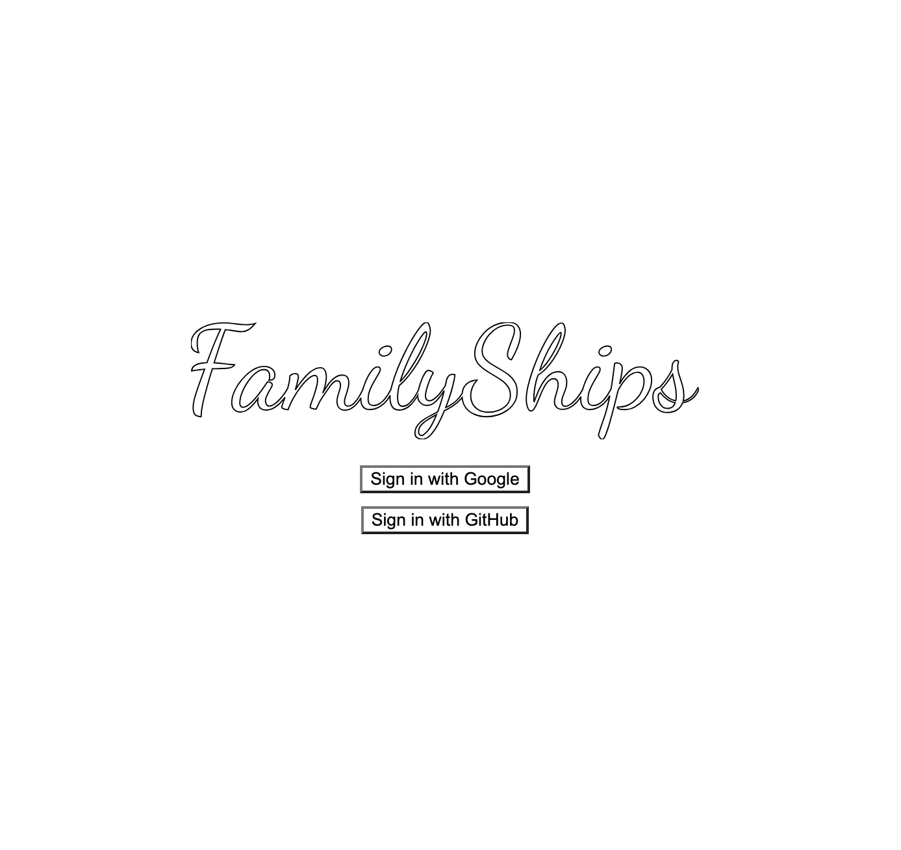
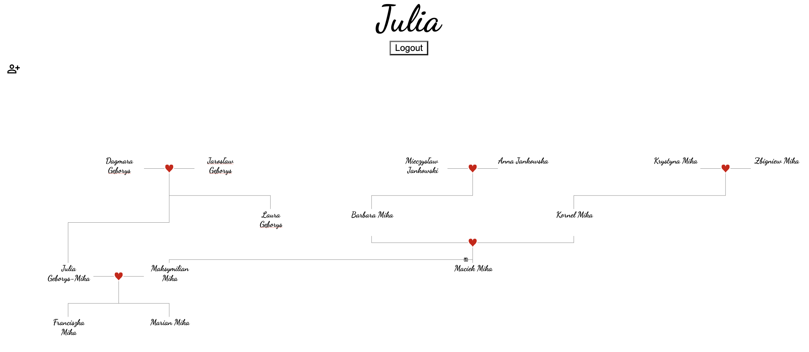

# FamilyShips

A web application for creating and visualizing family trees.




## How to host?

### Secrets

First, create a file called `/src/main/resources/secret.properties`, with the following contents:

```
DB_USER=<MySQL user name>
DB_PASS=<MySQL password>
GIT_CLIENT_ID=<from https://github.com/settings/developers>
GIT_SECRET=<generated from https://github.com/settings/developers>
GOOGLE_CLIENT_ID=<Google client id>
GOOGLE_SECRET=<Google secret>
```

How to get all those values is described below.

### MySql

#### Hosting locally

You need to download MySQL and run it locally. 

To create a local database in MySql you need to do:

```
$ sudo ./mysql -p # This might require you to pass in some passwords
mysql> create database FamilyShips; -- Creates the new database
mysql> grant all on FamilyShips.* to 'julia'; -- Grants all the permissions to the user  
```

To recreate the database you need to drop it and recreate it using the above steps. 
To drop the database you do:

```
$ sudo ./mysql -p # This might require you to pass in some passwords
mysql> drop database FamilyShips;
```

#### Hosted externally

You can use an external instance of MySQL by adding a line `MYSQL_HOST=<host>` to `secret.properties`.

#### Requirements

You need to setup a database called `FamilyShips` within the chosen MySQL instance. You also need one user that will be able to interact with that database. Put the credentials of this user in `DB_USER` and `DB_PASS`.

### Git

You need to go to https://github.com/settings/developers and setup an application. You then need to get the `GIT_CLIENT_ID` and `GIT_SECRET`.

### Google

Follow the guide on "Setting up OAuth 2.0" on https://developers.google.com/identity/openid-connect/openid-connect to get the `GOOGLE_CLIENT_ID` and `GOOGLE_SECRET`.

## Debugging

### MySql

To debug the status of the databases one can do:

NOTE You might need to do `$ cd /usr/local/mysql/bin` to find the `mysql` command.

```
$ sudo ./mysql -p # This might require you to pass in some passwords
mysql> connect FamilyShips;
mysql> show tables; -- Show what tables are available
mysql> select * from user; -- Look at what users are registered on the platform
mysql> select * from family_parent; -- Look at family parent relationships
```

### Tests

There are separate tests for the backend and the frontend of the appliction.

#### Frontend tests

Frontend tests are living under [./src/main/resources/static/tree/*_test.ts](./src/main/resources/static/tree/). Those can be turned on by modifying [./src/main/resources/static/tree/con](./src/main/resources/static/tree/config.ts) the file, turning the `test` value to `true`. The tests will then run, whenever the javascript runs. 

Those tests do not require connection to the backend service. All of them fake the connection.

#### Backend tests

Those live under [./src/test/java/com/familyships/FamilyShips/*Test.java](./src/test/java/com/familyships/FamilyShips/). Those are JUnit tests.
