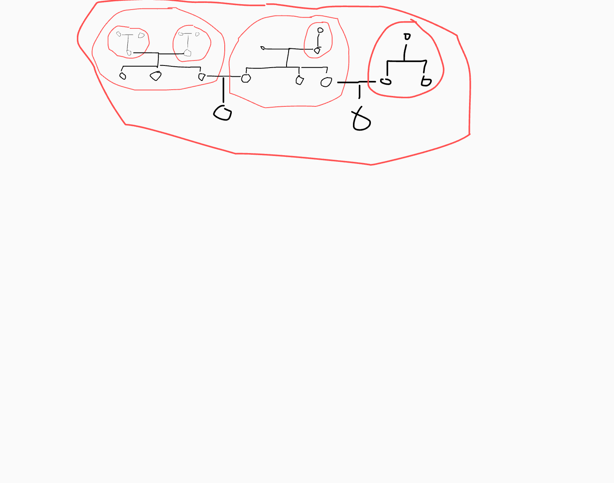

# Layout idea

I will try to document the process of thinking of the layout algorithm.

## Problems

Obviously the graph might not necessary be planar.

For instance a couple with three kids, each of them marries someone, how do I represent the parents of who they marry without crossing lines?

The genealogy tree is also not necessarily a tree. It's more like a DAG.

## Considered options

### `d3.tree()`

Good for visualizing trees, but, as mentioned in the Problems section, it might be not ideal. 

I could try to recursively apply it, using the fact that most families have at most two children, whose ascendants and descendants I might want to visualize, but I would prefer something more generic.

### `graphviz`

This library has many nice ways of visualizing graphs, that work out of the box. Sadly, it doesn't utilize the directionality of the data. I would prefer something that favors putting the older people higher than the younger and that's not easily done with `graphviz`

### Other libraries

There are many other libraries that provide layout or even whole rendering solutions. Sadly many of them require a payment and I want my code to be open source.

### Custom solution
 
Implementing the solution from scratch sound like the best idea, as I will learn the most and the solution will be tailor made to the constraints posed.

## Rough idea of the solution

I do smart topological sorting and laying out people in layers, depending on how high in the tree they are.
Then I attempt at laying out partners next to each other, possibly swapping above layers.

